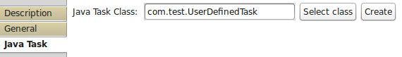

### JavaTask
***

With Java Task you can define your own task with Java programming language.

**Input Ports**

* Ports are defined by User.

**Output Ports**

* Ports are defined by User.

**Properties**

* **Implementation:** <em>&lt;fully qualified name&gt;</em> 
You can use search window to find the class. You can also open a wizard
to create a new Java Task Class either by clicking here or on right clicking
in Package Explorer (New -&gt; Other... -&gt; System in Cloud -&gt; Commons -&gt; Java Task Class).

Some properties are set inside annotation in Java Task Class implementation. They are:

* **atomic:** <em><b>true</b>|false</em> 
    You can set if the task will be atomic or not (see User Guide).

* **generator:** <em>true|<b>false</b></em> 
    You can indicate that this Task will be generating data periodically even if it doesn't receive any.
      
* **external source:** <em>true|<b>false</b></em> 
    This Task can be activated in any moment depending on external conditions. (e.g. receiving data from Internet).

* **constant:** <em>true|<b>false</b></em> 
    This task is run only once when the parent module is activated synchronously.
    
<pre><code>
package com.test;

import org.ruminaq.tasks.javatask.api.InputPort;
import org.ruminaq.tasks.javatask.api.JavaTask;
import org.ruminaq.tasks.javatask.api.OutputPort;
import org.ruminaq.tasks.javatask.api.annotations.InputPortInfo;
import org.ruminaq.tasks.javatask.api.annotations.JavaTaskInfo;
import org.ruminaq.tasks.javatask.api.annotations.OutputPortInfo;
import org.ruminaq.tasks.javatask.api.data.Int64;
import org.ruminaq.tasks.javatask.api.data.Bool;

@JavaTaskInfo(atomic=true, generator=true, externalSource=true)
public class MyJavaTaskClass extends JavaTask {

    @InputPortInfo(name = "RST", dataType = Int64.class, asynchronous=true)
    public InputPort rst;

    @InputPortInfo(name = "In1", dataType = Int64.class)
    public InputPort in1;
    @InputPortInfo(name = "In2", dataType = Int64.class)
    public InputPort in2;
    @OutputPortInfo(name = "Out", dataType = Bool.class)
    public OutputPort out;

    @Override
    public void execute(int grp) {
        /*
         * Here you define what's
         * happen when all synchronous ports from group
         * received data or your generator code
         * is ready to action.
         */
    }

    @Override
    public void executeAsync(InputPort asyncIn) {
        /*
         * Here you define what's
         * happen when a asynchronous port
         * received data. Port is in argument
         */
    }

    @Override
    public void executeExtSrc() {
        /*
         * Here is made an action after you
         * notify Modeler that this Task is
         * ready to run
         */
    }

    @Override
    public void generate() {
        /*
         * Here is made a periodical action
         * as part of generator
         */
    }
}

</code></pre>
